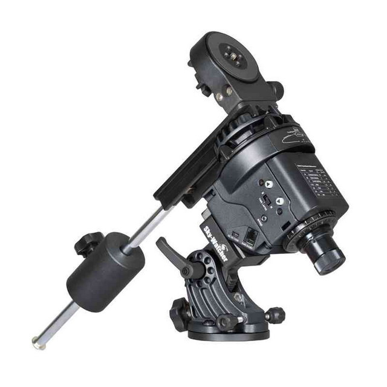
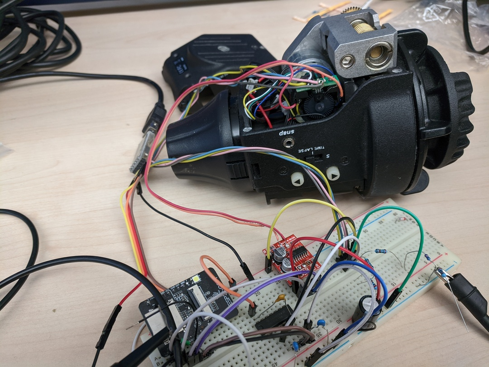

# Replace Star Adventurer controller with ESP32

The goal of this project is to upgrade controller board
of the old Star Adventurer camera mount
with ESP32 and use open source firmware.

## Current status

- POC controlling motor speed
- POC implementing EQMOD protocol